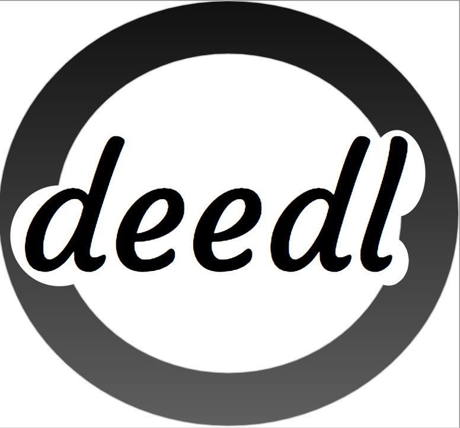

<!-- Headings -->
# **Deedl**

##### Accomplice

## *A web forum for do gooders and those who need good to be done!*

___

⚠️ ⚠️ Disclaimer: This web application is a group project and is still in development. ⚠️ ⚠️ 
___

### Table of Contents

* [Rationale](#Rationale)
* [Getting Started](#Getting_Started)
* [Benefits](#Benefits)
* [Useful Links](#Useful_Links)
* [Developers](#Developers)

#### Rationale

People need to build community. This forum for bringing groups closer together and helping the needy is a way of doing just that.

#### Description

Join a team or create a new one. Search for good deeds to complete for people in need. Coordinate with available memebers of your group. Complete the task, get kudos for your entire group.

#### Getting Started

- Receive an invite

- Choose your team

- Choose a good deed to complete

- Organise which members of your group are available to help out

- Do good deeds together for the community and earn points

- The team with the most points at the end of each round is the winner!

#### Benefits

- Brings friends and strangers in groups closer together. 

- Rewards selflessness.

- Helps those in need.

- Saves more cats in trees per minute.

#### Useful Links

[Heroku Link](https://deedl.herokuapp.com/)

#### Developers

> Luke Harrison, Tanner York, Thom d'Olanie, William Chadwick
